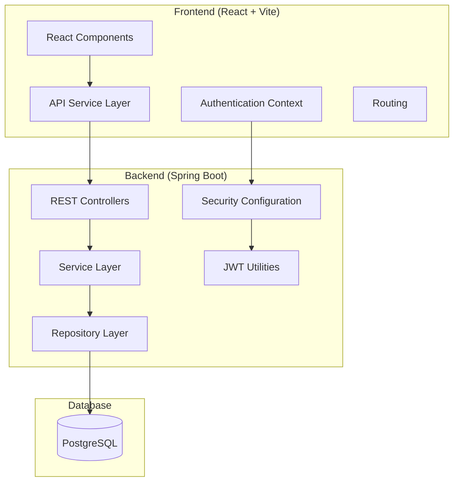
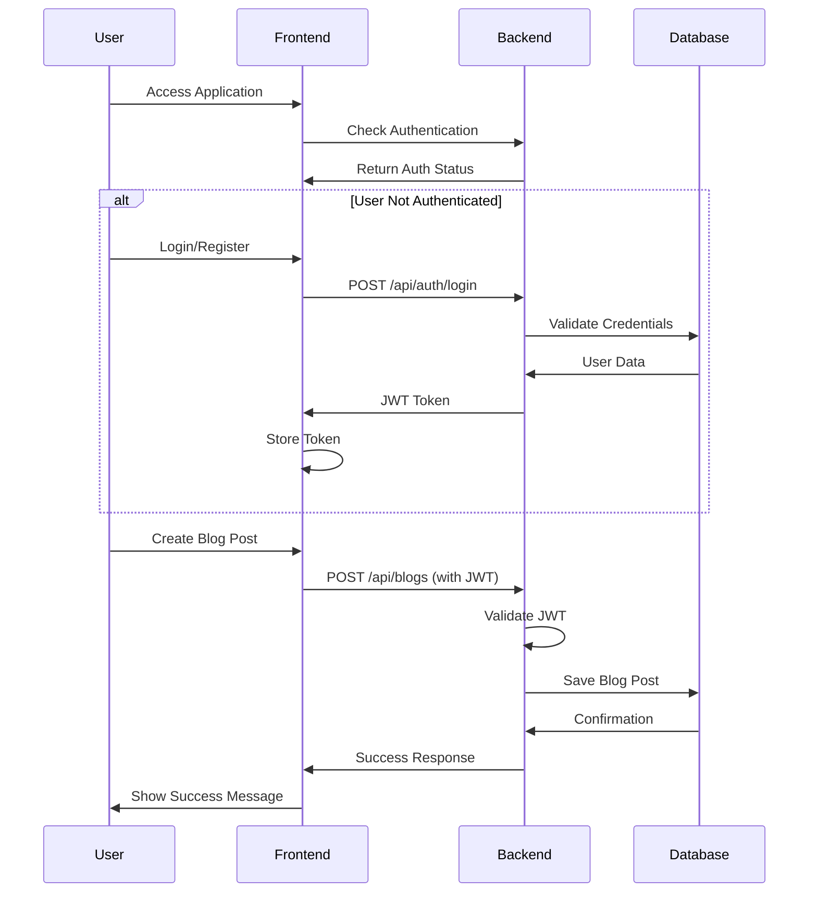
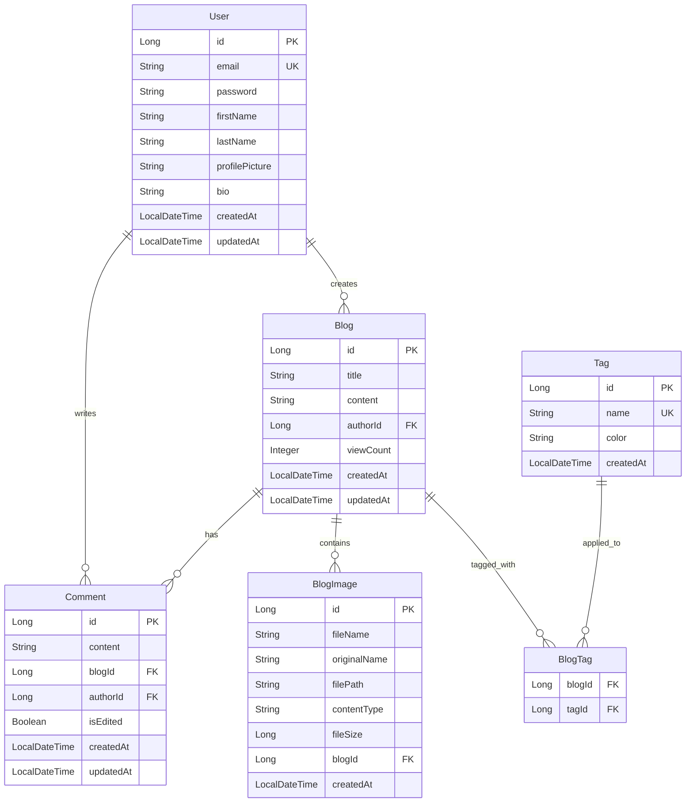

# Design Document

## Overview

The blog application follows a modern full-stack architecture with a React frontend communicating with a Spring Boot backend through RESTful APIs. The system uses JWT-based authentication, PostgreSQL for data persistence, and implements responsive design with Tailwind CSS.

### Technology Stack
- **Frontend**: React 19.1.1 with Vite, Tailwind CSS 4.1.13
- **Backend**: Spring Boot 3.5.5 with Java 21
- **Database**: PostgreSQL
- **Authentication**: JWT with Spring Security
- **Build Tools**: Maven (backend), Vite (frontend)

## Architecture

### System Architecture



### Application Flow



## Components and Interfaces

### Frontend Components

#### Core Components
- **App.jsx**: Main application component with routing
- **AuthContext.jsx**: Authentication state management
- **PrivateRoute.jsx**: Protected route wrapper
- **Layout.jsx**: Common layout with navigation

#### Page Components
- **LoginPage.jsx**: User authentication form
- **RegisterPage.jsx**: User registration form
- **BlogListPage.jsx**: Public blog listing with pagination
- **BlogDetailPage.jsx**: Individual blog post view
- **CreateBlogPage.jsx**: Blog creation form (authenticated)
- **EditBlogPage.jsx**: Blog editing form (author only)

#### Utility Components
- **Navbar.jsx**: Navigation component
- **Pagination.jsx**: Reusable pagination component
- **LoadingSpinner.jsx**: Loading state indicator
- **ErrorMessage.jsx**: Error display component

### Backend Components

#### Controllers
- **AuthController**: Handles authentication endpoints
  - `POST /api/auth/register`
  - `POST /api/auth/login`
  - `POST /api/auth/logout`
- **BlogController**: Manages blog operations
  - `GET /api/blogs` (public, paginated, with sorting/filtering)
  - `GET /api/blogs/{id}` (public, increments view count)
  - `POST /api/blogs` (authenticated)
  - `PUT /api/blogs/{id}` (author only)
  - `DELETE /api/blogs/{id}` (author only)
- **CommentController**: Manages comment operations
  - `GET /api/blogs/{blogId}/comments` (public, paginated)
  - `POST /api/blogs/{blogId}/comments` (authenticated)
  - `PUT /api/comments/{id}` (author only)
  - `DELETE /api/comments/{id}` (author only)
- **TagController**: Manages tag operations
  - `GET /api/tags` (public, returns all tags)
  - `GET /api/tags/popular` (public, returns popular tags)
  - `POST /api/tags` (authenticated, create new tag)
- **UserController**: Manages user profile operations
  - `GET /api/users/profile` (authenticated, own profile)
  - `PUT /api/users/profile` (authenticated, update profile)
  - `GET /api/users/{id}/blogs` (public, user's blogs)
  - `GET /api/users/{id}/comments` (public, user's comments)
- **ImageController**: Manages image uploads
  - `POST /api/blogs/{blogId}/images` (author only)
  - `DELETE /api/images/{id}` (author only)
  - `GET /api/images/{filename}` (public, serve images)

#### Services
- **AuthService**: Authentication business logic
- **BlogService**: Blog management business logic with sorting/filtering
- **UserService**: User management and profile operations
- **CommentService**: Comment management business logic
- **TagService**: Tag management and popularity tracking
- **ImageService**: Image upload, storage, and management

#### Repositories
- **UserRepository**: JPA repository for User entity
- **BlogRepository**: JPA repository for Blog entity with custom queries for sorting/filtering
- **CommentRepository**: JPA repository for Comment entity
- **TagRepository**: JPA repository for Tag entity
- **BlogImageRepository**: JPA repository for BlogImage entity

## Data Models

### Database Schema



### Entity Classes

#### User Entity
```java
@Entity
@Table(name = "users")
public class User {
    @Id
    @GeneratedValue(strategy = GenerationType.IDENTITY)
    private Long id;
    
    @Column(unique = true, nullable = false)
    private String email;
    
    @Column(nullable = false)
    private String password;
    
    @Column(nullable = false)
    private String firstName;
    
    @Column(nullable = false)
    private String lastName;
    
    @CreationTimestamp
    private LocalDateTime createdAt;
    
    @UpdateTimestamp
    private LocalDateTime updatedAt;
    
    @OneToMany(mappedBy = "author", cascade = CascadeType.ALL)
    private List<Blog> blogs;
}
```

#### Blog Entity
```java
@Entity
@Table(name = "blogs")
public class Blog {
    @Id
    @GeneratedValue(strategy = GenerationType.IDENTITY)
    private Long id;
    
    @Column(nullable = false)
    private String title;
    
    @Column(columnDefinition = "TEXT", nullable = false)
    private String content;
    
    @ManyToOne(fetch = FetchType.LAZY)
    @JoinColumn(name = "author_id", nullable = false)
    private User author;
    
    @Column(nullable = false, columnDefinition = "INTEGER DEFAULT 0")
    private Integer viewCount = 0;
    
    @CreationTimestamp
    private LocalDateTime createdAt;
    
    @UpdateTimestamp
    private LocalDateTime updatedAt;
    
    @OneToMany(mappedBy = "blog", cascade = CascadeType.ALL, orphanRemoval = true)
    private List<Comment> comments = new ArrayList<>();
    
    @OneToMany(mappedBy = "blog", cascade = CascadeType.ALL, orphanRemoval = true)
    private List<BlogImage> images = new ArrayList<>();
    
    @ManyToMany
    @JoinTable(
        name = "blog_tags",
        joinColumns = @JoinColumn(name = "blog_id"),
        inverseJoinColumns = @JoinColumn(name = "tag_id")
    )
    private Set<Tag> tags = new HashSet<>();
}
```

#### Tag Entity
```java
@Entity
@Table(name = "tags")
public class Tag {
    @Id
    @GeneratedValue(strategy = GenerationType.IDENTITY)
    private Long id;
    
    @Column(unique = true, nullable = false)
    private String name;
    
    @Column
    private String color;
    
    @CreationTimestamp
    private LocalDateTime createdAt;
    
    @ManyToMany(mappedBy = "tags")
    private Set<Blog> blogs = new HashSet<>();
}
```

#### Comment Entity
```java
@Entity
@Table(name = "comments")
public class Comment {
    @Id
    @GeneratedValue(strategy = GenerationType.IDENTITY)
    private Long id;
    
    @Column(columnDefinition = "TEXT", nullable = false)
    private String content;
    
    @ManyToOne(fetch = FetchType.LAZY)
    @JoinColumn(name = "blog_id", nullable = false)
    private Blog blog;
    
    @ManyToOne(fetch = FetchType.LAZY)
    @JoinColumn(name = "author_id", nullable = false)
    private User author;
    
    @Column(nullable = false, columnDefinition = "BOOLEAN DEFAULT FALSE")
    private Boolean isEdited = false;
    
    @CreationTimestamp
    private LocalDateTime createdAt;
    
    @UpdateTimestamp
    private LocalDateTime updatedAt;
}
```

#### BlogImage Entity
```java
@Entity
@Table(name = "blog_images")
public class BlogImage {
    @Id
    @GeneratedValue(strategy = GenerationType.IDENTITY)
    private Long id;
    
    @Column(nullable = false)
    private String fileName;
    
    @Column(nullable = false)
    private String originalName;
    
    @Column(nullable = false)
    private String filePath;
    
    @Column(nullable = false)
    private String contentType;
    
    @Column(nullable = false)
    private Long fileSize;
    
    @ManyToOne(fetch = FetchType.LAZY)
    @JoinColumn(name = "blog_id", nullable = false)
    private Blog blog;
    
    @CreationTimestamp
    private LocalDateTime createdAt;
}
```

### DTOs (Data Transfer Objects)

#### Authentication DTOs
- **LoginRequest**: Email and password
- **RegisterRequest**: User registration data
- **AuthResponse**: JWT token and user info

#### Blog DTOs
- **BlogRequest**: Title, content, and tags for create/update
- **BlogResponse**: Complete blog data with author info, tags, comments count, view count
- **BlogSummaryResponse**: Blog list item with pagination, tags, and basic stats

#### Comment DTOs
- **CommentRequest**: Content for create/update
- **CommentResponse**: Complete comment data with author info and timestamps

#### Tag DTOs
- **TagRequest**: Name and color for create/update
- **TagResponse**: Tag data with usage count

#### User Profile DTOs
- **UserProfileRequest**: Profile update data
- **UserProfileResponse**: Complete profile data with activity summary

#### Image DTOs
- **ImageUploadResponse**: Image metadata after successful upload
- **ImageResponse**: Image data with URLs

## Error Handling

### Backend Error Handling
- **GlobalExceptionHandler**: Centralized exception handling
- **Custom Exceptions**:
  - `UserNotFoundException`
  - `BlogNotFoundException`
  - `UnauthorizedAccessException`
  - `ValidationException`

### Frontend Error Handling
- **API Error Interceptor**: Handles HTTP errors globally
- **Error Boundaries**: React error boundaries for component errors
- **Toast Notifications**: User-friendly error messages
- **Form Validation**: Client-side validation with error display

### HTTP Status Codes
- `200 OK`: Successful operations
- `201 Created`: Resource creation
- `400 Bad Request`: Validation errors
- `401 Unauthorized`: Authentication required
- `403 Forbidden`: Access denied
- `404 Not Found`: Resource not found
- `500 Internal Server Error`: Server errors

## Security Implementation

### Authentication Flow
1. User submits credentials
2. Backend validates against database
3. JWT token generated with user claims
4. Token returned to frontend
5. Frontend stores token in localStorage
6. Token included in subsequent API requests
7. Backend validates token on protected endpoints

### Security Configuration
- **CORS**: Configured for frontend domain
- **CSRF**: Disabled for stateless JWT authentication
- **Password Encoding**: BCrypt hashing
- **JWT Configuration**: Secret key, expiration time
- **Route Protection**: Public vs authenticated endpoints

## Testing Strategy

### Backend Testing
- **Unit Tests**: Service layer business logic
- **Integration Tests**: Repository layer database operations
- **Controller Tests**: API endpoint testing with MockMvc
- **Security Tests**: Authentication and authorization

### Frontend Testing
- **Component Tests**: Individual component functionality
- **Integration Tests**: Component interaction
- **E2E Tests**: Complete user workflows
- **API Integration Tests**: Frontend-backend communication

### Test Coverage Goals
- Backend: 80% code coverage minimum
- Frontend: 70% component coverage minimum
- Critical paths: 100% coverage (authentication, blog CRUD)

## Performance Considerations

### Database Optimization
- **Indexing**: Email (unique), blog author_id, created_at
- **Pagination**: Limit query results for blog listing
- **Lazy Loading**: User-blog relationships
- **Connection Pooling**: HikariCP configuration

### Frontend Optimization
- **Code Splitting**: Route-based lazy loading
- **Caching**: API response caching
- **Debouncing**: Search and form inputs
- **Image Optimization**: If blog images are added later

### API Design
- **RESTful Principles**: Consistent endpoint design
- **Pagination**: Page-based pagination for blog lists
- **Response Compression**: Gzip compression
- **Rate Limiting**: Prevent API abuse

## Deployment Architecture

### Development Environment
- **Frontend**: Vite dev server (port 5173)
- **Backend**: Spring Boot embedded Tomcat (port 8080)
- **Database**: Local PostgreSQL instance

### Production Considerations
- **Frontend**: Static files served by CDN or web server
- **Backend**: Containerized Spring Boot application
- **Database**: Managed PostgreSQL service
- **Environment Variables**: Database credentials, JWT secrets
- **HTTPS**: SSL/TLS encryption
- **Monitoring**: Application health checks and logging