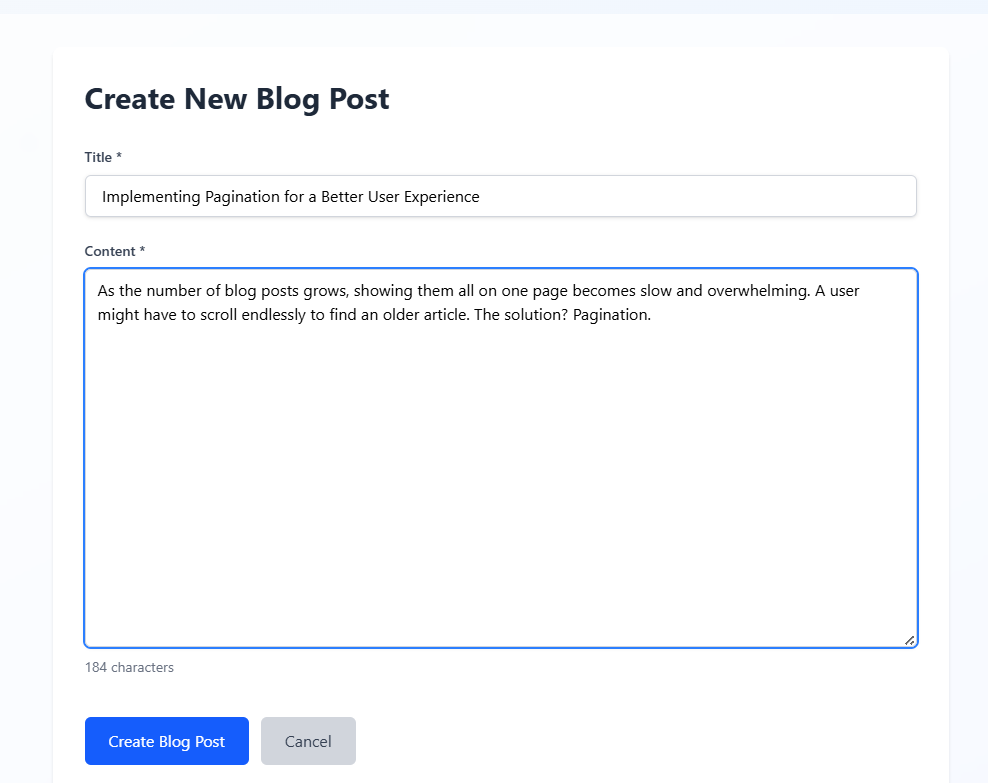

# Blog Application - Full Stack Assessment

A full-stack blog application built with React and Spring Boot, featuring user authentication, blog management, and responsive design.


## 🚀 Features

- **User Authentication**: Secure JWT-based login and registration
- **Blog Management**: Create, read, update, and delete blog posts
- **Public Access**: Anyone can view blogs, only authenticated users can create/edit
- **Responsive Design**: Works seamlessly on desktop and mobile devices
- **Pagination**: Efficient blog listing with pagination support
- **Author Controls**: Blog authors can edit and delete their own posts


## 🛠 Technology Stack

### Frontend

- **React 18** - Modern UI framework
- **React Router** - Client-side routing
- **Tailwind CSS** - Utility-first CSS framework
- **Axios** - HTTP client for API requests

### Backend

- **Spring Boot 3.5.5** - Java web framework
- **Spring Security** - Authentication and authorization
- **Spring Data JPA** - Database abstraction layer
- **PostgreSQL** - Relational database
- **JWT** - Stateless authentication tokens

## 📋 Prerequisites

- **Java 21** or higher
- **Node.js 18** or higher
- **PostgreSQL 12** or higher
- **Maven 3.6** or higher

## 🏃‍♂️ Quick Start

### 1. Clone the Repository

```bash
git clone <repository-url>
cd BlogApp
```

### 2. Database Setup

```sql
-- Create database
CREATE DATABASE blogapp;

-- Create user (optional)
CREATE USER blogapp_user WITH PASSWORD 'your_password';
GRANT ALL PRIVILEGES ON DATABASE blogapp TO blogapp_user;
```

### 3. Backend Setup

```bash
cd blogapp

# Update application.properties with your database credentials
# src/main/resources/application.properties

# Run the Spring Boot application
mvn spring-boot:run
```

The backend will start on `http://localhost:8082`

### 4. Frontend Setup

```bash
cd blogfront/blogfront

# Install dependencies
npm install

# Start the development server
npm run dev
```

The frontend will start on `http://localhost:5173`

## 📁 Project Structure

```
BlogApp/
├── blogapp/                 # Spring Boot backend
│   ├── src/main/java/
│   │   └── com/blogapp/blogapp/
│   │       ├── controller/  # REST controllers
│   │       ├── service/     # Business logic
│   │       ├── entity/      # JPA entities
│   │       ├── dto/         # Data transfer objects
│   │       ├── config/      # Configuration classes
│   │       └── security/    # Security components
│   └── src/main/resources/
│       ├── application.properties
│       └── schema.sql
├── blogfront/blogfront/     # React frontend
│   ├── src/
│   │   ├── components/      # Reusable components
│   │   ├── pages/          # Page components
│   │   ├── contexts/       # React contexts
│   │   └── services/       # API services
│   └── public/
└── README.md
```

## 🔗 API Endpoints

### Authentication

- `POST /api/auth/register` - User registration
- `POST /api/auth/login` - User login
- `POST /api/auth/logout` - User logout

### Blogs

- `GET /api/blogs` - Get all blogs (public, paginated)
- `GET /api/blogs/{id}` - Get blog by ID (public)
- `POST /api/blogs` - Create new blog (authenticated)
- `PUT /api/blogs/{id}` - Update blog (author only)
- `DELETE /api/blogs/{id}` - Delete blog (author only)

## 🎨 Pages

1. **Home Page** (`/`) - Public blog listing with pagination
2. **Login Page** (`/login`) - User authentication
3. **Register Page** (`/register`) - User registration
4. **Create Blog** (`/create`) - Blog creation (protected)
5. **Blog Detail** (`/blog/:id`) - Individual blog view (public)
6. **Edit Blog** (`/edit/:id`) - Blog editing (author only)

## 🔐 Security Features

- JWT-based stateless authentication
- Password encryption using BCrypt
- Route protection for authenticated users
- Author-only access for blog editing/deletion
- CORS configuration for cross-origin requests

## 📱 Responsive Design

The application is fully responsive and optimized for:

- Desktop (1024px+)
- Tablet (768px - 1023px)
- Mobile (320px - 767px)

## 🚀 Deployment

### Backend Deployment

```bash
# Build the JAR file
mvn clean package

# Run the JAR
java -jar target/blogapp-0.0.1-SNAPSHOT.jar
```

### Frontend Deployment

```bash
# Build for production
npm run build

# The dist/ folder contains the production build
```

## 🧪 Testing

### Backend Tests

```bash
cd blogapp
mvn test
```

### Frontend Tests

```bash
cd blogfront/blogfront
npm test
```

## 🌐 Live Demo

**Frontend URL**: [https://blog-app-kappa-two-40.vercel.app/](https://blog-app-kappa-two-40.vercel.app/)

## 📸 Screenshots

### Home Page


### Create Blog Page



## 👥 Usage

1. **Register** a new account or **login** with existing credentials
2. **Browse blogs** on the home page (no authentication required)
3. **Create new blogs** after logging in
4. **Edit or delete** your own blog posts
5. **View detailed** blog posts by clicking on titles

## 🤝 Contributing

1. Fork the repository
2. Create a feature branch
3. Commit your changes
4. Push to the branch
5. Create a Pull Request

## 📄 License

This project is licensed under the MIT License - see the [LICENSE](LICENSE) file for details.

---


